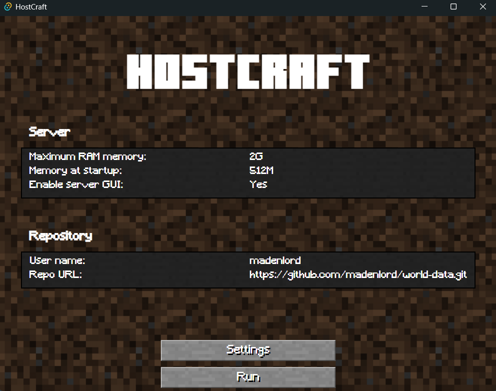
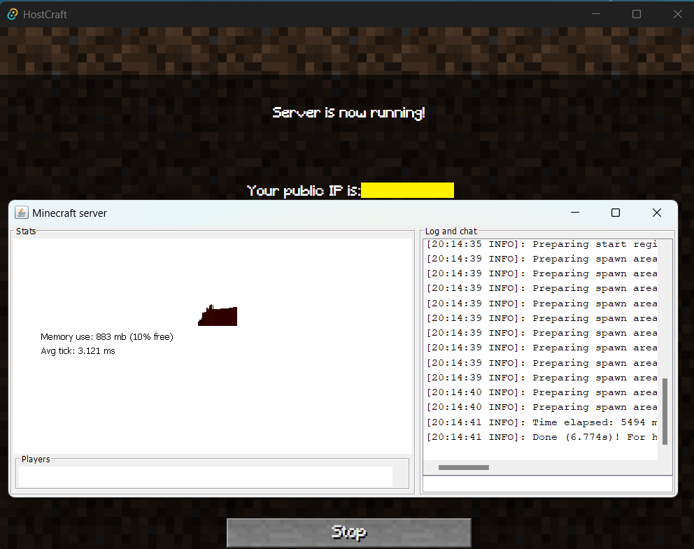

# HostCraf: Share your world data with your friends!

HostCraft is a small project that aims to make it easier to host a Minecraft server with your friends. 
With this tool, any of your mates can host your common Minecraft server at any time, and as they wish! 

When running the server, and if no one is already hosting it, the latest world data is downloaded.
Then, when the server is stopped and closed, the world data is uploaded to the world repository and the host is released.

This way, there is absolutely no need of a central server: anyone can be the host of your party and can run the server as they wish!

## About the project

The main goals of this personal project are the following:

1. Challenge myself with three new languages/frameworks (Rust, React-TS and Tauri)
2. Build a desktop application with Tauri to play Miencraft with my friends as we wish, with no central server whatsoever.

